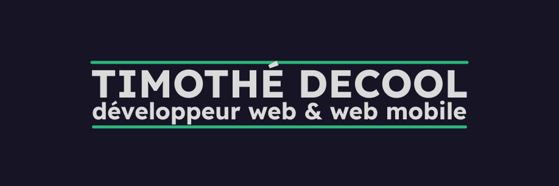

# Bienvenue à tou·te·s 👋

À l'âge de 28 ans, après quelques années en science politique et dans le monde associatif, je découvre véritablement l'univers du développement web. Je m'en passionne vite et m'engage dans une reconversion. Ce profil GitHub rassemble des travaux effectués dans le cadre de ma formation et des petits projets personnels. Bonne visite !

## Ce qu'on peut trouver ici 📖
Tu souhaites jeter un coup d'oeil dans mes dépôts ? Voici un petit sommaire des choses à voir. 👇

### Des jeux en JavaScript 🎲
Depuis le début de mon apprentissage, construire des petits jeux a été l'une de mes activités de choix pour développer ma logique algorithmique et ma connaissance de JavaScript. Pas forcément finalisés en termes d'interface, mais toujours opérationnels sur le coeur des mécaniques de jeu :
<a href="https://github.com/timdecool/wordle" target="_blank">Wordle</a> -
<a href="https://github.com/timdecool/mastermind" target="_blank">Mastermind</a> -
<a href="https://github.com/timdecool/typing-game" target="_blank">Typing game</a> -
<a href="https://github.com/timdecool/memory-game" target="_blank">Memory</a> -
<a href="https://github.com/timdecool/pendu" target="_blank">Jeu du pendu</a>

### Des petits projets PHP 🐘
Sur la base de projets d'entraînement initiés dans le cadre de ma formation, des expérimentations supplémentaires pour tester les possibilités de PHP, en suivant un design pattern MVC. Les projets sont à finaliser et à mettre en ligne prochainement :
<a href="https://github.com/timdecool/live-messenger" target="_blank">Appli live messenger</a> -
<a href="https://github.com/timdecool/crud_training" target="_blank">Petit réseau social</a> -
<a href="https://github.com/timdecool/oop-mvc" target="_blank">Entraînement MVC orienté objet</a>

### Des exercices d'intégration 👨‍🎨
Pour pratiquer les bases, HTML, CSS, JavaScript, les librairies (et notamment Bootstrap), le Sass, etc.
<a href="https://github.com/timdecool/mobilefirst-htmlcssproject" target="_blank">Un site de photographie d'oiseaux en mobile-first avec Bootstrap</a> -
<a href="https://github.com/timdecool/sass-training" target="_blank">Un pied de page avec Sass</a> -
<a href="https://github.com/timdecool/integration-training" target="_blank">Intégration d'une maquette sans l'aide d'une librairie</a>

## Mes outils de travail 🛠️

### Frontend

  
    
    
  
  
   

### Backend

 
  
  
  

<!--
**timdecool/timdecool** is a ✨ _special_ ✨ repository because its `README.md` (this file) appears on your GitHub profile.

Here are some ideas to get you started:

- 🔭 I’m currently working on ...
- 🌱 I’m currently learning ...
- 👯 I’m looking to collaborate on ...
- 🤔 I’m looking for help with ...
- 💬 Ask me about ...
- 📫 How to reach me: ...
- 😄 Pronouns: ...
- ⚡ Fun fact: ...
-->
